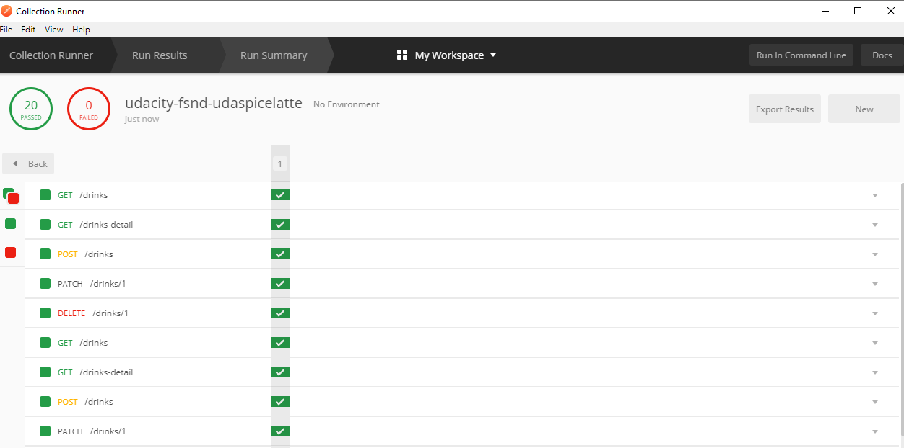
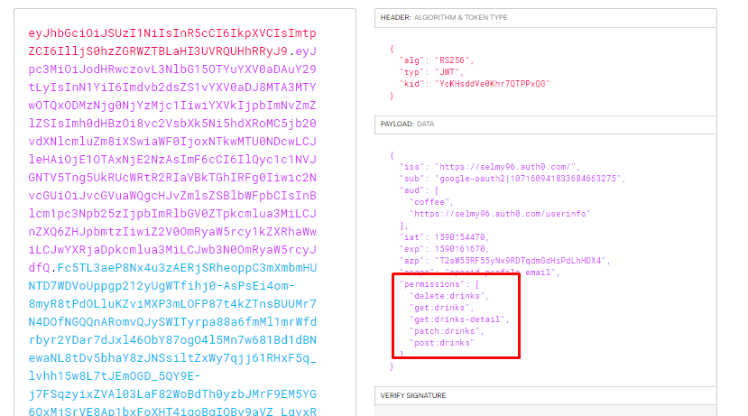
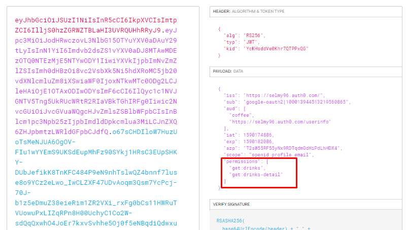

# Coffee Shop Backend API
This is part of Udacitys' Full-Stack Developer Nano-degree.

## Base URL

> Since this API is not hosted on a specific domain, it can only be accessed when
`flask` is run locally. To make requests to the API via `curl` or `postman`,
you need to use the default domain on which the flask server is running. 

> **_http://127.0.0.1:5000/_**

## Endpoints

### 1. GET /drinks

- Fetches a list of drinks short description.
- Returns: 
  - List of drinks with following fields:
      - **int** `id`
      - **object** `recipe`
        - **string** `color`
        - **int** `parts`
      - **string** `title`
  - **boolean** `success`
 - Example:
   - Url: http://127.0.0.1:5000/drinks
   - Response: [output](./outputs/get_all_drinks.json)
   
### 2. GET /drinks-detail

- Fetches a list of drinks detailed description.
- Returns: 
  - List of drinks with following fields:
      - **int** `id`
      - **object** `recipe`
        - **string** `color`
        - **string** `name`
        - **int** `parts`
      - **string** `title`
  - **boolean** `success`
 - Example:
   - Url: http://127.0.0.1:5000/drinks-detail
   - Response: [output](./outputs/get_all_drinks_details.json)
- Errors:
  - Bad request 400: if title is already existing
  - Un-authorized 401: if token hasn't `get:drinks-detail` permission
  - Forbidden 403: if JWT is not attached

### 3. POST /drinks

- Posts new drink.
- Request Body:
  - **string** `title`
  - **recipe** `list`
    - **string** `color`
    - **string** `name`
    - **int** `parts`
- Returns: 
  - List of drinks with following fields:
      - **int** `id`
      - **recipe** `object`
        - **string** `color`
        - **string** `name`
        - **int** `parts`
      - **string** `title`
  - **boolean** `success`
 - Example:
   - Url: http://127.0.0.1:5000/drinks
   - Body: [body](./outputs/post_drink_body.json)
   - Response: [output](./outputs/post_drink_response.json)
- Errors:
  - Bad request 400: if title is already existing
  - Un-authorized 401: if token hasn't `post:drinks` permission
  - Forbidden 403: if JWT is not attached

### 4. PATCH /drinks/<drink_id>

- Edits existing drink.
- Request Body:
  - [OPTIONAL] **string** `title` 
  - [OPTIONAL] **recipe** `list`
    - **string** `color`
    - **string** `name`
    - **int** `parts`
- Returns: 
  - List of drinks with following fields:
      - **int** `id`
      - **recipe** `object`
        - **string** `color`
        - **string** `name`
        - **int** `parts`
      - **string** `title`
  - **boolean** `success`
 - Example:
   - Url: http://127.0.0.1:5000/drinks/1
   - Body: [body](./outputs/patch_drink_body.json)
   - Response: [output](./outputs/patch_drink_response.json)
- Errors:
  - Not found 404: if id doesn't exist
  - Un-authorized 401: if token hasn't `patch:drinks` permission
  - Forbidden 403: if JWT is not attached

### 4. DELETE /drinks/<drink_id>

- Deletes existing drink.
- Returns: 
  - **int** `delete`
  - **boolean** `success`
 - Example:
   - Url: http://127.0.0.1:5000/drinks/3
   - Response: [output](./outputs/delete_drink_response.json)
- Errors:
  - Not found 404: if id doesn't exist
  - Un-authorized 401: if token hasn't `post:drinks` permission
  - Forbidden 403: if JWT is not attached

## Postman testing
The api passed 100% of postman [testcase](udacity-fsnd-udaspicelatte.postman_collection.json)

## Tokens
All required permissions have been created and added to its' corresponding rule.
- Manager JWT:

- Barista JWT:
 
